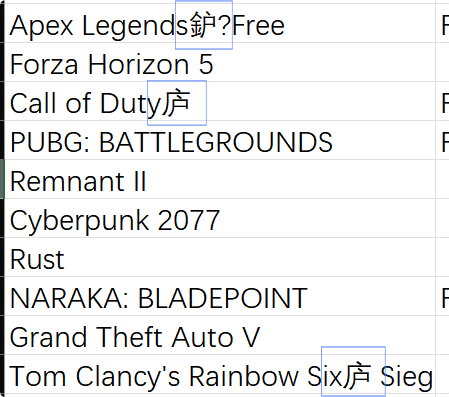
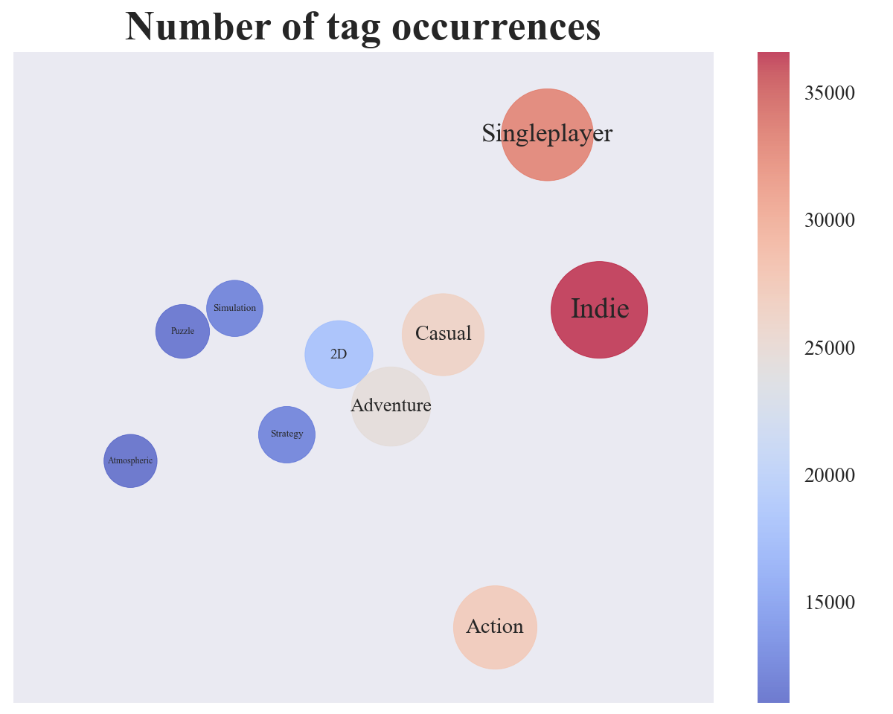
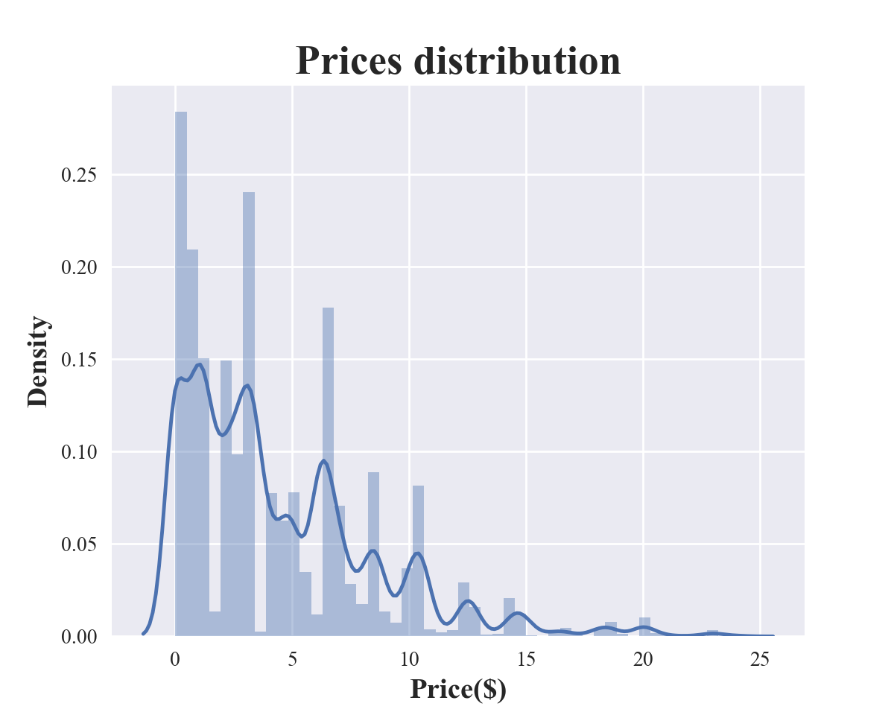
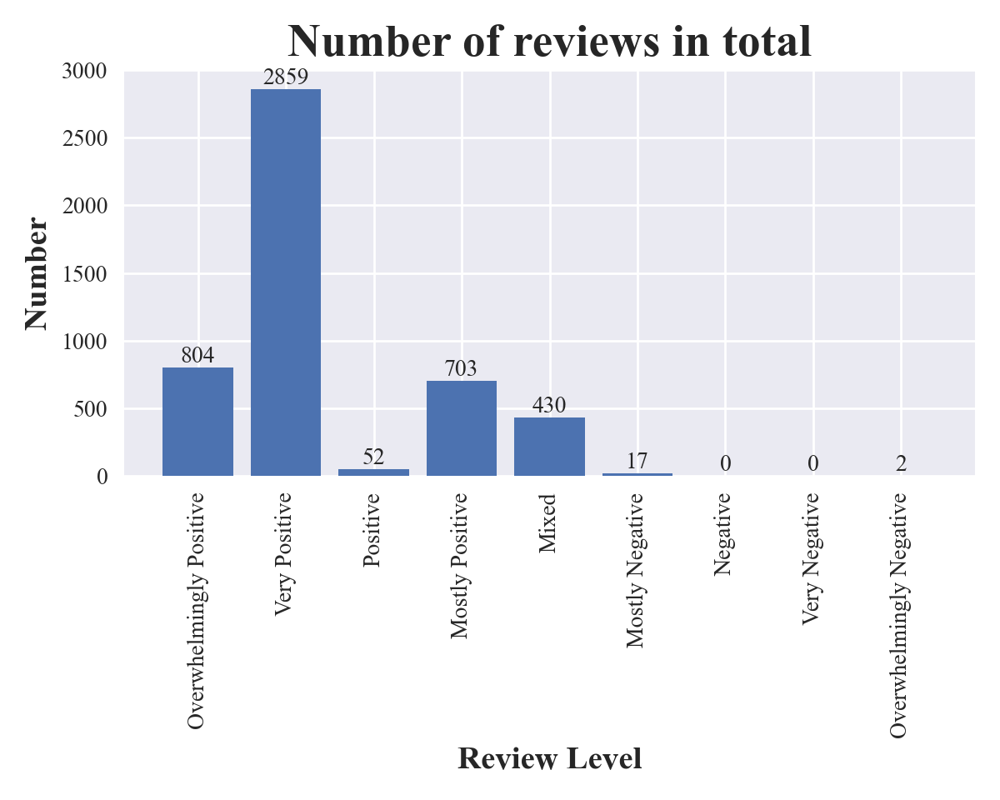
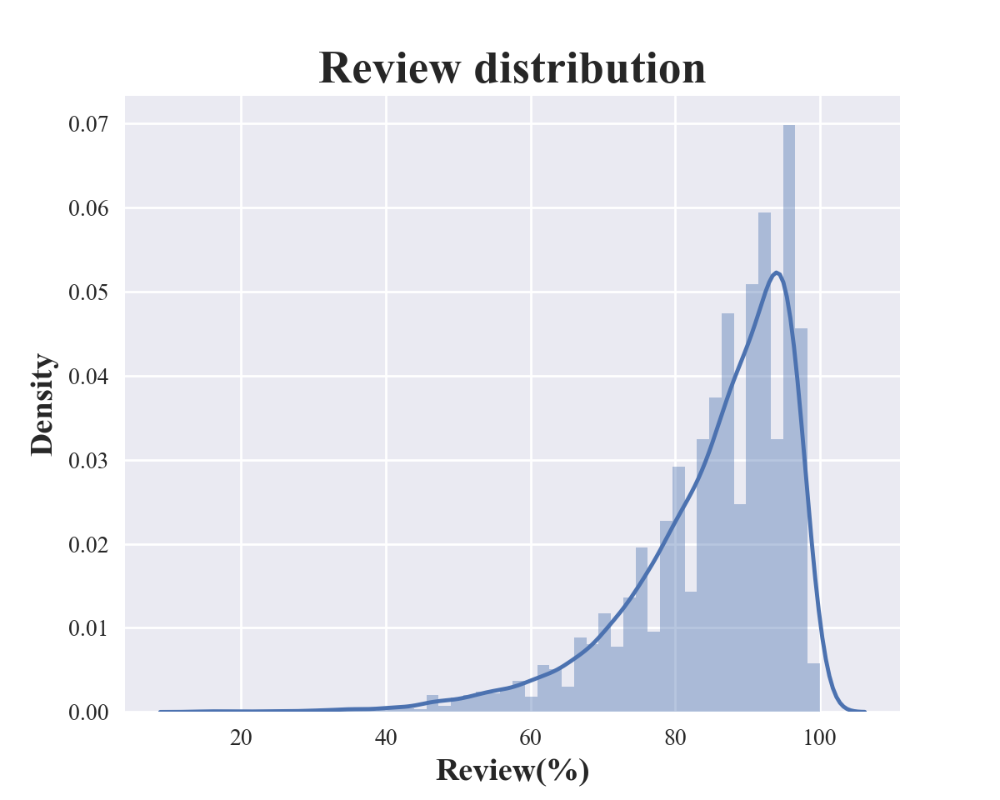

# Steam 游戏数据可视化

## 数据来源声明

数据来源：[Data Source](https://www.kaggle.com/datasets/nikatomashvili/steam-games-dataset)

## 引言 Introduction

Steam平台作为全球最大的数字游戏发行和分发平台，扮演着重要的角色，为数亿玩家提供了丰富多样的游戏选择。自Steam平台的推出以来，游戏行业发生了翻天覆地的变化，游戏数量和种类不断增加，玩家社区也日益庞大和多样化。

为了更好地了解和分析Steam平台上的游戏情况，对其进行可视化是一种强有力的手段。通过对Steam所有游戏的数据进行可视化，我们可以深入了解游戏市场的发展趋势、不同类型游戏的受欢迎程度以及玩家的偏好和行为。

本报告旨在通过可视化的方式呈现Steam平台上所有游戏的数据，以便更好地理解和分析游戏市场的现状和特点。我们将使用最新的数据集和先进的数据可视化工具，将游戏数据转化为直观、易于理解的图表和图像。

通过这些可视化呈现，读者可以更直观地了解Steam平台上游戏的数量、类型分布、评分情况以及玩家活动等方面的信息。我们还将探索不同游戏类型之间的关联性和趋势，以及热门游戏的受欢迎程度和影响因素。

通过本报告，我们希望能够帮助游戏开发者、发行商和玩家更好地了解游戏市场的动态，为游戏的开发、发行和选择提供有益的参考。同时，我们也希望通过这种数据驱动的分析和可视化，促进游戏行业的创新和发展，为玩家提供更好的游戏体验。

## 数据处理

### 数据清洗

原始数据为.CSV格式的表格文件，共保存了 **71544** 个在Steam平台上发行过的游戏，由于原始数据通过爬虫算法获取，数据比较脏，首先进行数据清洗流程。

<center>



</center>

对于原始的.CSV格式文件，首先使用 Python 的re包(正则表达式)工具进行数据清理，处理内容如下

1. 清除掉™、emoji等特殊字符。
2. 清除掉内容重复的行。
3. 统一日期为mm/dd/yy格式
4. 清理Popular Tags列与Game Features列
5. 清除掉乱码的字符，与非英文语境下的字符。

处理后总共得到 **69251** 个游戏的数据。

## 可视化

### 数量随时间变化

为了统计Steam商城中游戏的总数量随着时间的变化，首先提取出数据中包含了发售日期的游戏数据，并按照时间顺序升序排序。得到发售日期列表。并进行逐日统计，结果如图所示：

<center>


</center>

可以看出，数据整体呈现指数增长。证明游戏行业在过去的时间里发展非常迅速，且目前未见有明显衰退迹象。

### 类型分布

游戏类型数据为 ```Tag```筛选出数据后，首先进行频度统计。其中出现次数最多的两个 Tag 为```Indie```和```Single-player```。前十个出现频率最高的 Tag 如下图所示：

<center>



</center>

其中，每个圆形的面积与颜色代表了该 Tag 的出现次数。可以看出，同时出现频率较高的还有放松游戏与动作游戏。这可能与平台选择有关，Steam作为最大的游戏发布平台，任何个人与组织在通过审核与流程后均可上传自己制作的游戏，这也就使得独立游戏数量远超其他类型。

### 价格分布

首先研究总体价格的统计分布情况，由于价格数据极个别具有非常极端值，这些值为输入错误。这里首先进行手动清楚，只有游戏价格超过150美元（1095 RMB 2023/11/4）才会被纳入进行统计分析。其次根据3 Sigma原则进行数据清洗，清理掉异常值。数据的均值与标准差为5.0080 和 6.4854，根据3 Sigma原则，则剔除掉价格大于 24.4643 美金的游戏。

处理完成后绘制分布图如下:



从图中可以看出，绝大部分的Steam游戏为免费或者几乎免费游戏，数据并没有很好的遵守正态分布。

同时需要注意的是，大多数高质量3A游戏(AAA Game)价格均高于 24.4643 美金，上述数据清理方法虽然可以展示出整个Steam商城的价格分布，但是也剔除掉了少数关键的的高质量、高热度游戏。

### 评价分布

对游戏评价的数据分为评价等级(Positive, Mixed,Negative等)与评价分布( 在 XX 的总人数中 XX% 的人给出了Positive的评价)

首先对第一种评价等级进行研究，统计所有数据中每种等级出现的次数，如下：



可以看出大部分游戏的评价均为正面，同时也可以注意到，该项目数据污染严重，仅有5千多个游戏该项数据有效。且统计结果中Negative的评价几乎为0.

接着对评价分布数据进行研究，分布图如下：



这里同样可以得到大部分游戏评价均为正面的结论。

### 开发者

这一部分来统计在Steam发行的游戏中的开发者的分布情况，如下图所示：


从图中可以看出，在Steam上开发游戏数量最多的开发者是```'Choice of Games'```。其游戏类型全部为小成本独立小游戏，这一结果也印证了上文的结论。